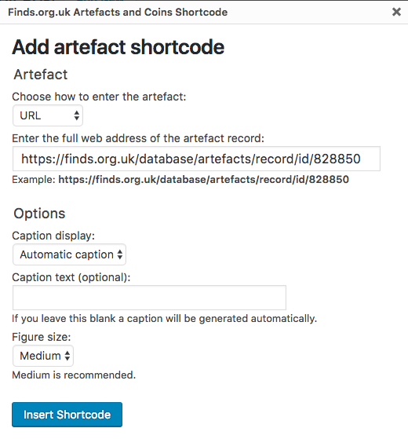

# Finds.org.uk Artefacts and Coins

A WordPress plugin that creates <a href="https://en.support.wordpress.com/shortcodes/">shortcodes</a> 
for displaying up-to-date <a href="https://finds.org.uk/database">finds.org.uk</a> artefacts and coins on your WordPress site. 


## Finds.org.uk Open Data

Most images and all public data on finds.org.uk are Creative Commons licensed. 
Reusing and sharing finds.org.uk Open Data on your website or blog is easy with this plugin.

## Shortcodes

The simplest possible shortcode just needs the record id and inserts a picture and caption automatically:

`[artefact id=828850]`

You can also specify a caption text and the image size*: 

`[artefact id=828850 caption-text="An incomplete post medieval umbonate bridle boss" figure-size=large]`

*image size is not yet implemented.

Or, if you prefer, no caption at all:

`[artefact id=828850 caption-option=none]`

All the images come with copyright information and an attribution.

## Shortcode options

The shortcode takes the following attributes:

* **id** - the record id of the artefact (required)
* **caption-option** - whether to display a caption or not (optional)
  * auto - caption is automatically generated from the record or the caption-text provided (default)
  * none - no caption
* **caption-text** - the text to display as the caption (optional)
* **figure-size** - the relative size of the image (_not yet implemented_)
  * small
  * medium (default)
  * large

## Editor button

The plugin installs a button in the editor toolbar to make it easy to insert a shortcode.


Insert the cursor in your post where you want the shortcode to appear and press the button.

A popup appears to take your options:



You can enter the artefact as:

* URL - e.g. https://finds.org.uk/database/artefacts/record/id/828850
* Unique ID - which you can find on the artefact record page - e.g. IOW-647A2A
* Record ID - which is the id found at the end of the URL e.g. 828850

Press 'Insert Shortcode' to check your input and create your shortcode.

Update your post and view it to see the image:


# Installation

The plugin is not yet available from the 'Add Plugins' page in your WordPress installation. However, we hope to make it available soon!
 
There are two different ways install from this Github repository. You'll need to be an administrator of your WordPress installation to 
do this.
 
 1. Click on the green 'Clone or download' button in this repository and choose Download zip. 
 
    Then go to the 'Plugins > Add New' page of your WordPress installation, click the 'Upload Plugin' button and 
    choose the zip file you just downloaded. You won't get all the updates from the repo this way, but this is the 
    simplest way to install at the moment.
 
 2. Alternatively, if you have direct access to your server (and probably sudo access) you can install the plugin via git:
 
    Navigate to the wp-content/plugins directory of your WordPress installation and clone this repository:
 
    `$ git clone https://github.com/findsorguk/wp-findsorguk finds-org-uk-artefacts-and-coins`

    Go to the 'Plugins' page of your WordPress installation and find 'Finds.org.uk Artefacts and Coins' in the list. 
    To activate the plugin click 'Activate' (or 'Network Activate' if you have a multisite installation and want it to be 
available to all the sites in your installation).

# How it works

Finds.org.uk provides JSON versions of its artefact records and search results, which are computer readable. 
The user inserts a shortcode into a post with an artefact record id and the plugin fetches the data for that 
record from the finds.org.uk JSON feeds.

When you enter an artefact by its 'unique id' (e.g. IOW-647A2A) in the popup form the plugin makes an ajax request 
to the finds.org.uk search index to extract the 'record id' (i.e. 828850) for you.

## Example JSON response from finds.org.uk

```
{
	"record":[
		{
			"id":"828850",
			"old_findID":"IOW-647A2A",
			"uniqueID":"PAS589647A2001A99",
			"objecttype":"BRIDLE BIT",
			"classification":"Boss",
			"subclass":null,
			"length":"27",
			"height":null,
			"width":"23.9",
			"weight":"5.03",
			"thickness":"5.4",
			"diameter":null,
			"quantity":"1",
			"otherRef":"IOW2017-8-25",
			"curr_loc":"Finder",
			"discoveryMethod":"1",
			"treasureID":null,
			"broadperiod":"POST MEDIEVAL",
			"numdate1":"1600",
			"numdate2":"1700",
			"description":"<p>An incomplete post-Medieval copper-alloy bridle boss (c. 1600-c. 1700).<\/p>\n\n<p>This boss is umbonate in form and is now sub-circular in plan. The centre is domed with a flat border. When complete, the border consisted of evenly spaced pierced lugs but only one now survives complete. At the front, the dome has three incised lines crossing at the centre to form six segments. At the rear the centre is concave with the scar of a spike at the centre.<\/p>\n\n<p>The bridle boss is reddish brown with patches of a greenish buff patina.<\/p>\n\n<p>Length: 27.0mm; width: 23.9mm; thickness: 5.4mm. Weight: 5.03g.<\/p>",
			"notes":null,
			"reuse":null,
			"reusePeriodID":null,
			"created":"2017-02-04 21:29:06",
			"updated":"2017-02-05 18:55:14",
			"secwfstage":"4",
			"findofnote":null,
			"objecttypecert":"2",
			"datefound1":"2017-01-04",
			"datefound2":"2017-01-04",
			"inscription":null,
			"museumAccession":null,
			"subsequentAction":"1",
			"objectCertainty":"Probably",
			"dateFromCertainty":"1",
			"dateToCertainty":"1",
			"dateFoundFromCertainty":null,
			"dateFoundToCertainty":null,
			"subPeriodFrom":"1",
			"subPeriodTo":"3",
			"objdate1period":"36",
			"objdate2period":"36",
			"secuid":"PAS589647A2001A99",
			"material1":"7",
			"material2":null,
			"manmethod":null,
			"decmethod":null,
			"decstyle":null,
			"complete":"2",
			"surface":null,
			"manufactureID":null,
			"culture":null,
			"recorderID":"0013F72EB3001EB0",
			"identifier1ID":"0013F72EB3001EB0",
			"identifier2ID":"0013FBB8E4401C75",
			"smrRef":null,
			"createdBy":"99",
			"updatedBy":"99",
			"hoardcontainer":null,
			"institution":"IOW",
			"reason":null,
			"fullname":"Frank Basford",
			"primaryMaterial":"Copper alloy",
			"primaryBMmaterial":"10627",
			"secondaryMaterial":null,
			"secondaryBMmaterial":null,
			"decoration":null,
			"style":null,
			"manufacture":null,
			"surfaceTreatment":null,
			"completeness":"Incomplete",
			"preservation":"Poor",
			"periodFrom":"POST MEDIEVAL",
			"seneschalPeriodFrom":"PM",
			"bmPeriodFrom":"x41047",
			"periodoPeriodFrom":"p0gjgrs6sgx",
			"periodTo":"POST MEDIEVAL",
			"seneschalPeriodTo":"PM",
			"bmPeriodTo":"x41047",
			"periodoPeriodTo":"p0gjgrs6sgx",
			"reusePeriod":null,
			"ascribedCulture":null,
			"culturePeriodo":null,
			"cultureBM":null,
			"discmethod":"Metal detector",
			"identifier":"Mr Frank Basford",
			"secondaryIdentifier":"Mr Peter Reavill",
			"recorder":"Mr Frank Basford",
			"fromCirca":"Circa",
			"toCirca":"Circa",
			"findSpotID":"828547",
			"countyID":"25469",
			"districtID":"25469",
			"regionID":"41421",
			"knownas":"Isle of Wight",
			"gridlen":"10",
			"accuracy":"1",
			"what3words":"dwell.grain.hydration",
			"source":"Generated from computer mapping software",
			"coinID":null,
			"obverseDescription":null,
			"obverseInscription":null,
			"reverseDescription":null,
			"reverseInscription":null,
			"cciNumber":null,
			"denominationID":null,
			"degreeOfWear":null,
			"allenType":null,
			"vaType":null,
			"mackType":null,
			"abcType":null,
			"bmcType":null,
			"reeceID":null,
			"dieAxis":null,
			"moneyer":null,
			"revtypeID":null,
			"categoryID":null,
			"typeID":null,
			"tribeID":null,
			"statusID":null,
			"rulerQualifier":null,
			"denominationQualifier":null,
			"mintQualifier":null,
			"dieAxisCertainty":null,
			"initialMark":null,
			"reverseMintMark":null,
			"statusQualifier":null,
			"ruler1":null,
			"ruler2":null,
			"mintID":null,
			"rrcID":null,
			"ricID":null,
			"tribe":null,
			"ironAgeRegion":null,
			"ironAgeArea":null,
			"denomination":null,
			"nomismaDenomination":null,
			"dbpediaDenomination":null,
			"bmDenomination":null,
			"primaryRuler":null,
			"viaf":null,
			"rulerDbpedia":null,
			"nomismaRulerID":null,
			"secondaryRuler":null,
			"periodName":null,
			"dateRange":null,
			"mintName":null,
			"nomismaMintID":null,
			"pleiadesID":null,
			"mintGeonamesID":null,
			"mintWoeid":null,
			"mintOsID":null,
			"mintGettyID":null,
			"mintWoeID":null,
			"mintDbPediaID":null,
			"mintWhat3Words":null,
			"mintBritMuseumID":null,
			"wear":null,
			"nomismaWear":null,
			"dieAxisName":null,
			"category":null,
			"type":null,
			"moneyerID":null,
			"nomismaMoneyer":null,
			"emperorID":null,
			"romanMintID":null,
			"reverseType":null,
			"status":null,
			"jettonClass":null,
			"jettonType":null,
			"jettonGroup":null,
			"thumbnail":"600333",
			"filename":"IOW2017825.JPG",
			"filesize":"2129070",
			"imageLabel":"Post-Medieval Bridle Boss",
			"imageCopyrightHolder":"The Portable Antiquities Scheme",
			"imageLicense":"Attribution-ShareAlike License",
			"imagedir":"images\/fbasford\/",
			"region":"South East",
			"rallyID":null,
			"rallyName":null,
			"rallyDateFrom":null,
			"rallyDateTo":null,
			"landuse":"Operations to a depth greater than 0.25m",
			"landvalue":"Cultivated land",
			"regionType":"European Region",
			"countyType":"Unitary Authority",
			"county":"Isle of Wight",
			"districtType":"Unitary Authority",
			"district":"Isle of Wight",
			"parishType":"Civil Parish",
			"subsequentActionTerm":"Returned to finder",
			"bmThesObject":null,
			"seneschalObject":"95671"
		}
	]
}
```

# Author

Mary Chester-Kadwell, The British Museum

# License 

GPL v3

# To do

* Caching of data to prevent unnecessary get requests and so speed up posts and pages
* Image size options
* Admin option to suppress error messages if desired

# Known issues

* When two or more images are available on an artefact record it is not possible to choose which image is displayed 
by the shortcode, because only one is made available in the JSON by finds.org.uk, and typically it is not the main image.
* When images are deleted or replaced on finds.org.uk the JSON is not always updated, therefore sometimes 
an image will display as broken by the shortcode even though an image appears correctly on the original record itself.
